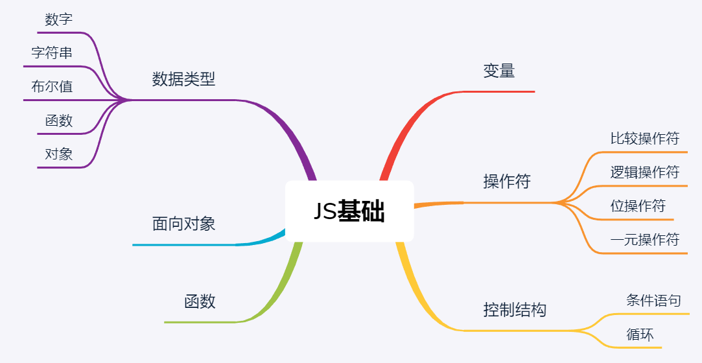
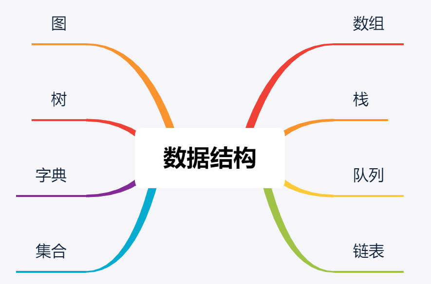

## JavaScript基础

> JavaScript的类型有数字、字符串、布尔值、函数和对象。还有undefined和null，以及数组、日期和正则表达式。

## 数据结构导图


## 数组
几乎所有的编程语言都原生支持数组类型，因为数组是最简单的内存数据结构。

##### 1、创建和初始化数组

```javascript
// 用中括号（[]）的形式创建数组   
var daysOfWeek = [];

// 使用一些元素初始化数组
var daysOfWeek = ['Sunday', 'Monday', 'Tuesday', 'Wednesday','Thursday', 'Friday', 'Saturday'];

// 使用new关键字，声明并初始化一个数组（行{1}）。
var daysOfWeek = new Array(); //

// 创建一个指定长度的数组（行{2}）
var daysOfWeek = new Array(7); //

// 使用Array.of 方法创建数组
let daysOfWeek = Array.of('Sunday', 'Monday', 'Tuesday', 'Wednesday','Thursday', 'Friday', 'Saturday');

// 使用数组的length属性查看元素数量
console.log(daysOfWeek.length); // 输出7
```
##### 2、访问和迭代元素
- for...in 不应该被用来迭代一个下标顺序很重要的 Array，因为它以任意顺序遍历一个对象的可枚举属性，数组遍历不一定按次序访问元素。   
- 不要使用for each...in语句遍历数组,仅用来遍历常规对象。  

```javascript
let daysOfWeek = ['Sunday', 'Monday', 'Tuesday', 'Wednesday','Thursday', 'Friday', 'Saturday'];

// for 循环遍历数组，打印元素
for (var i=0; i<daysOfWeek.length; i++){
  console.log(daysOfWeek[i]);
}

// forEach()循环遍历数组，打印元素
daysOfWeek.forEach(function(el) {
    console.log(el);
});

// forEach()箭头函数
daysOfWeek.forEach(el => {
    console.log(el);
});
```
- for…of 循环  
&emsp;&emsp;for...of 语句创建一个循环来迭代可迭代的对象。在 ES6 中引入的 for...of 循环，以替代 for...in 和 forEach() ，并支持新的迭代协议。for...of 允许你遍历 Arrays（数组）, Strings（字符串）, Maps（映射）, Sets（集合）等可迭代的数据结构等。
```javascript
const programmming = ['Java', 'Python', 'JavaScript'];
for (const value of programmming) {
  console.log(value);
}
```
##### 3、添加元素

```javascript
// 创建并且初始化
var numbers = [0,1,2,3,4,5,6,7,8,9];

// 把值赋给数组中最后一个空位上的元素
numbers[numbers.length] = 10;

// 使用push方法，能把元素添加到数组的末尾。
numbers.push(11);
numbers.push(12, 13);

// 使用unshift，能把元素添加到数组的首位。
numbers.unshift(-2);
numbers.unshift(-4, -3);

// 所有的元素向右移动一位
for (var i=numbers.length; i>=0; i--){
  numbers[i] = numbers[i-1];
}
```
##### 3、删除元素

```javascript
// 使用pop方法，删除数组里的末尾元素
numbers.pop();

// 使用shift，删除数组的第一个元素
numbers.shift();
```

##### 4、splice方法
```javascript
// 任意位置删除元素
numbers.splice(5,3);  // 从数组索引5开始的3个元素。

// 任意位置添加元素
/* 
splice方法接收的第一个参数，表示想要删除或插入的元素的索引值。
第二个参数是删除元素的个数（这个例子里，我们的目的不是删除元素，所以传入0）。
第三个参数往后，就是要添加到数组里的值（元素2、3、4）。
 */
numbers.splice(5,0,2,3,4);

```
##### 5、二维和多维数组
JavaScript只支持一维数组，并不支持矩阵。但是，我们可以用数组套数组，实现矩阵或任一多维数组。
```javascript
var averageTemp = [];
averageTemp[0] = [72,75,79,79,81,81];
averageTemp[1] = [81,79,75,75,73,72];
```
迭代二维数组的元素
> 使用一个嵌套的for循环来处理，其中变量i为行，变量j为列。

```javascript
// 创建一个通用的矩阵输出函数
function printMatrix(twoDimensionalArray) {
  for (var i = 0; i < twoDimensionalArray.length; i++){
    for (var j = 0; j < twoDimensionalArray[i].length; j++){
      console.log(twoDimensionalArray[i][j]);
    }
  }
}
```
多维数组
```javascript
// 创建一个3×3×3的矩阵
var matrix3x3x3 = [];
for (var i=0; i<3; i++){
  matrix3x3x3[i] = [];
  for (var j=0; j<3; j++){
    matrix3x3x3[i][j] = [];
    for (var z=0; z<3; z++){
      matrix3x3x3[i][j][z] = i+j+z;
    }
  }
}

// 3层嵌套for语句
for (var i=0; i<matrix3x3x3.length; i++){
  for (var j=0; j<matrix3x3x3[i].length; j++){
    for (var z=0; z<matrix3x3x3[i][j].length; z++){
      console.log(matrix3x3x3[i][j][z]);
    }
  }
}
```
###### 数组常用方法列表
| 方法名称 | 	说明 | 
| :---         |     :---:      |
| concat | 连接2个或更多数组，并返回结果 |
| every | 对数组中的每一项运行给定函数，如果该函数对每一项都返回true，则返回true |
| filter | 对数组中的每一项运行给定函数，返回该函数会返回true的项组成的数组 |
| forEach | 对数组中的每一项运行给定函数。这个方法没有返回值 |    
| join | 将所有的数组元素连接成一个字符串 |    
| indexOf | 返回第一个与给定参数相等的数组元素的索引，没有找到则返回1 |    
| lastIndexOf | 返回在数组中搜索到的与给定参数相等的元素的索引里最大的值 |    
| map | 对数组中的每一项运行给定函数，返回每次函数调用的结果组成的数组 |    
| reverse | 颠倒数组中元素的顺序，原先第一个元素现在变成最后一个，同样原先的最后一个元素变成了现在的第一个。看过Vue文档的都应该不陌生 |    
| slice | 传入索引值，将数组里对应索引范围内的元素作为新数组返回 |    
| some | 对数组中的每一项运行给定函数，如果任一项返回true，则返回true |    
| sort | 按照字母顺序对数组排序，支持传入指定排序方法的函数作为参数 |    
| toString | 将数组作为字符串返回 |    
| valueOf | 和toString类似，将数组作为字符串返回 |    
|  |  |    

###### ES6和ES7新增的数组方法
| 方法名称 | 	说明 | 
| :---         |     :---:      |
| @@iterator | 返回一个包含数组键值对的迭代器对象，可以通过同步调用得到数组元素的键值对 |    
| copyWithin | 复制数组中一系列元素到同一数组指定的起始位置 |    
| entries | 返回包含数组所有键值对的@@iterator |    
| includes | 如果数组中存在某个元素则返回true，否则返回false。ES7新增 |    
| find | 根据回调函数给定的条件从数组中查找元素，如果找到则返回该元素 |    
| findIndex | 根据回调函数给定的条件从数组中查找元素，如果找到则返回该元素在数组中的索引 |    
| fill | 用静态值填充数组 |    
| from | 根据已有数组创建一个新数组 |    
| keys | 返回包含数组所有索引的@@iterator |    
| of | 根据传入的参数创建一个新数组 |    
| values | 返回包含数组中所有值的@@iterator |    
|  |  |     

##### 6、数组元素排序
sort方法
```javascript
var numbers = [15, 14, 13, 12, 11, 10, 9, 8, 7, 6, 5, 4, 3, 2, 1]
numbers.sort();  // >>[1, 10, 11, 12, 13, 14, 15, 2, 3, 4, 5, 6, 7, 8, 9]

numbers.sort(function(a, b){
  if (a < b) {
      return -1;
    }
    if (a > b) {
      return 1;
    }
    // a必须等于b
    return 0;
});
// >>1, 2, 3, 4, 5, 6, 7, 8, 9, 10, 11, 12, 13, 14, 15
```
任何对象类型的数组排序
```javascript
var friends = [
  {name: 'John', age: 30},
  {name: 'Ana', age: 20},
  {name: 'Chris', age: 25}
];
// 根据年龄排序
function comparePerson(a, b){
  if (a.age < b.age){
    return -1
  }
  if (a.age > b.age){
    return 1
  }
  return 0;
}
　
console.log(friends.sort(comparePerson));
```
忽略大小写的比较函数
```javascript
var names =['Ana', 'ana', 'john', 'John'];
names.sort(function(a, b){
  if (a.toLowerCase() < b.toLowerCase()){
    return -1
  }
  if (a.toLowerCase() > b.toLowerCase()){
    return 1
  }
  return 0;
});
```

##### 7、数组元素查找
- find和findIndex方法
```javascript
// find和findIndex方法接收一个回调函数，搜索一个满足回调函数条件的值。
let numbers = [1, 2, 3, 4, 5, 6, 7, 8, 9, 10, 11, 12, 13, 14, 15];
function multipleOf13(element, index, array) {
  return (element % 3 == 0) ? true : false;
}
// find方法返回第一个满足条件的值,如果没有满足条件的值，find会返回undefined
console.log(numbers.find(multipleOf13));
// findIndex方法则返回这个值在数组里的索引，如果没有满足条件的值，findIndex返回-1
console.log(numbers.findIndex(multipleOf13));
```
- includes方法
```javascript
// 如果数组里存在某个元素，includes方法会返回true，否则返回false。
console.log(numbers.includes(15));
console.log(numbers.includes(20));
```

## 栈
&emsp;&emsp;栈被称为一种后入先出（LIFO,last-in-first-out）的数据结构，是一种有序集合。新添加的或待删除的元素都保存在栈的同一端，称作栈顶，另一端就叫栈底。在栈里，新元素都靠近栈顶，旧元素都接近栈底。
#####　１、创建栈并添加元素  
选择数组这种数据结构来保存栈里的元素。   
push(element(s))：添加一个（或几个）新元素到栈顶。
```javascript
let items = [];

//  push添加元素到栈顶，也就是栈的末尾。
this.push = function(element){
  items.push(element);
};
```
##### 2、从栈移除元素
pop()：移除栈顶的元素，同时返回被移除的元素。
```javascript
// pop()：移除栈顶的元素，同时返回被移除的元素。
this.pop = function(){
  return items.pop();
};
```
##### 3、查看栈顶元素
peek()：返回栈顶的元素，不对栈做任何修改（这个方法不会移除栈顶的元素，仅仅返回它）。
```javascript
this.peek = function(){
  return items[items.length-1];
};
```
##### 4、检查栈是否为空
isEmpty()：如果栈里没有任何元素就返回true，否则返回false。
```javascript
//  使用isEmpty方法，我们能简单地判断内部数组的长度是否为0。
this.isEmpty = function(){
  return items.length == 0;
};
```
##### 5、清空和打印栈元素
clear()：移除栈里的所有元素。
```javascript
//  也可以多次调用pop方法，把数组中的元素全部移除，这样也能实现clear方法。
this.clear = function(){
  items = [];
};

this.print = function(){
  console.log(items.toString());
};
```

##### Stack类
&emsp;&emsp;Stack是一种高效率的数据结构，相比List，它仅支持在一端（尾部）进行存取操作，即常说的后进先出LIFO，经常应用于进位之间的转换。
在Java中，Stack也是通过数组实现的，而非链表。在JavaScript中类似，可以用ES6的简化语法把Stack函数转换成Stack类。
```javascript
/* 使用栈stack类的实现 */
function stack() {
    this.dataStore = [];  // 保存栈内元素，初始化为一个空数组
    this.top = 0;  // 栈顶位置，初始化为0
    this.push = push;  // 入栈
    this.pop = pop;  // 出栈
    this.peek = peek;  // 查看栈顶元素
    this.clear = clear;  // 清空栈
    this.length = length;  // 栈内存放元素的个数
}
function push(element){
    this.dataStore[this.top++] = element;
}

function pop(){
    return this.dataStore[--this.top];
}

function peek(){
    return this.dataStore[this.top-1];
}

function clear(){
    this.top = 0;
}

function length(){
    return this.top;
}
```
## 队列
&emsp;&emsp;队列是一种FIFO(First In First Out)，队列和栈结构不同，栈是一种后进先出的结构，而队列是一种先进先出的结构。
队列也是一种表结构，不同的是队列只能在队尾插入元素，在队首删除元素，可以将队列想象成在柜台排号，排在前面的人拥有优先服务权。
队列用在很多地方，比如提交操作系统执行一系列的进程，打印任务池等，一些仿真系统使用队列来模拟银行或者超时里排队的顾客。
##### 1、创建
使用数组创建一个用于存储队列中元素的数据结构。
```javascript
function Queue(){
    //这里是属性和方法
    this.dataStore = [];
    this.enqueue = enqueue;
    this.dequeue = dequeue;
    this.front = front;
    this.back = back;
    this.toString = toString;
    this.empty = empty;
}

//取出数组的最后一个元素
function back(){
    return this.dataStore[this.dataStore.length-1];
}

//返回数组中元素的个数
function count(){
    return this.dataStore.length;
}
```
##### 2、添加
enqueue(element(s))：向队列尾部添加一个（或多个）新的项。
```javascript
//  入队，就是在数组的末尾添加一个元素
function enqueue(element){
    this.dataStore.push(element);
}
```
##### 3、移除
dequeue()：移除队列的第一（即排在队列最前面的）项，并返回被移除的元素。
```javascript
// 出队，就是删除数组的第一个元素
function dequeue(){
    return this.dataStore.shift();
}
```
##### 4、取出第一个元素
front()：返回队列中第一个元素——最先被添加，也将是最先被移除的元素。队列不做任何变动（不移除元素，只返回元素信息——与Stack类的peek方法非常类似）。
```javascript
// 取出数组的第一个元素
function front(){
    return this.dataStore[0];
}
```

##### 5、判断是否为空
isEmpty()：如果队列中不包含任何元素，返回true，否则返回false。
```javascript
// 判断是否为空
function empty(){
    if(this.dataStore.length == 0){
        return true;
    }else{
        return false;
    }    
}
```
##### 6、打印队列
```javascript
function toString(){
    var retStr = "";
    for (var i=0; i<this.dataStore.length; ++i) {
        retStr += this.dataStore[i] + "&nbsp;"
    }
    return retStr;
}
```
