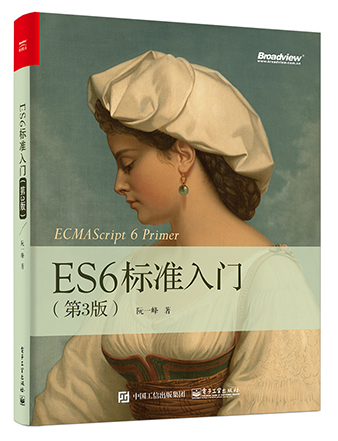

?> 擅于向优秀者学习，不断壮大自我。  
#### ECMAScript 6的新功能
- let和const
- 模板字面量
- 解构
- 展开操作符
- 箭头函数：=>
- 类

强烈推荐阮一峰老师的文章：[ECMAScript 6 入门](http://es6.ruanyifeng.com/)


```text
- 目录
第1章  ECMAScript 6简介
第2章  let和const命令
第3章  变量的解构赋值
第4章  字符串的扩展
第5章  正则的扩展
第6章  数值的扩展
第7章  函数的扩展
第8章  数组的扩展
第9章  对象的扩展
第10章  Symbol
第11章  Set和Map数据结构
第12章  Proxy
第13章  Reflect
第14章  Promise对象
第15章  Iterator和for...of循环
第16章  Generator函数的语法
第17章  Generator函数的异步应用
第18章  async函数
第19章  Class的基本语法
第20章  Class的继承
第21章  修饰器
第22章  Module的语法
第23章  Module的加载实现
第24章  编程风格
第25章  读懂ECMAScript规格
第26章  ArrayBuffer
```