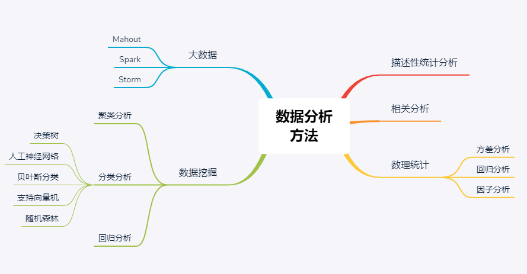

### 关于数据分析
&emsp;&emsp;有针对性的收集、加工、整理数据，并采用统计、挖掘技术分析和解释数据的科学与艺术。其实选用用什么工具不重要，重要的是一种数据分析的思维，业务思维很重要，业务是数据分析的灵魂。

&emsp;&emsp;人人都可以是一位数据分析师，数据分析需要的知识体系相对庞杂，也不好统一规范。无论使用Excel、R、Python还是其它工具方法，这些都没有标准，只要结果符合预期即可。

### 五大步骤
#### 1、明确数据分析的目的和内容
&emsp;&emsp; 做到有的放矢。
#### 2、收集数据
&emsp;&emsp; 除了日常的收集外，如果包含网络分析业务，则需要用到数据爬虫技术。
#### 3、处理数据
&emsp;&emsp; 这个是最麻烦的事情，尤其是在业务复杂多变的环境下，一次性观察不到，可能需要反复地修正和清理数据。
#### 4、分析数据
&emsp;&emsp;最多的就是统计分析，能真正用到数据分析理论方法的情况也不多。
#### 5、展示数据 
&emsp;&emsp;或者仅做个PPT写个报告、亦或者做Web应用的数据可视化。   

---

### 常用分析方法

