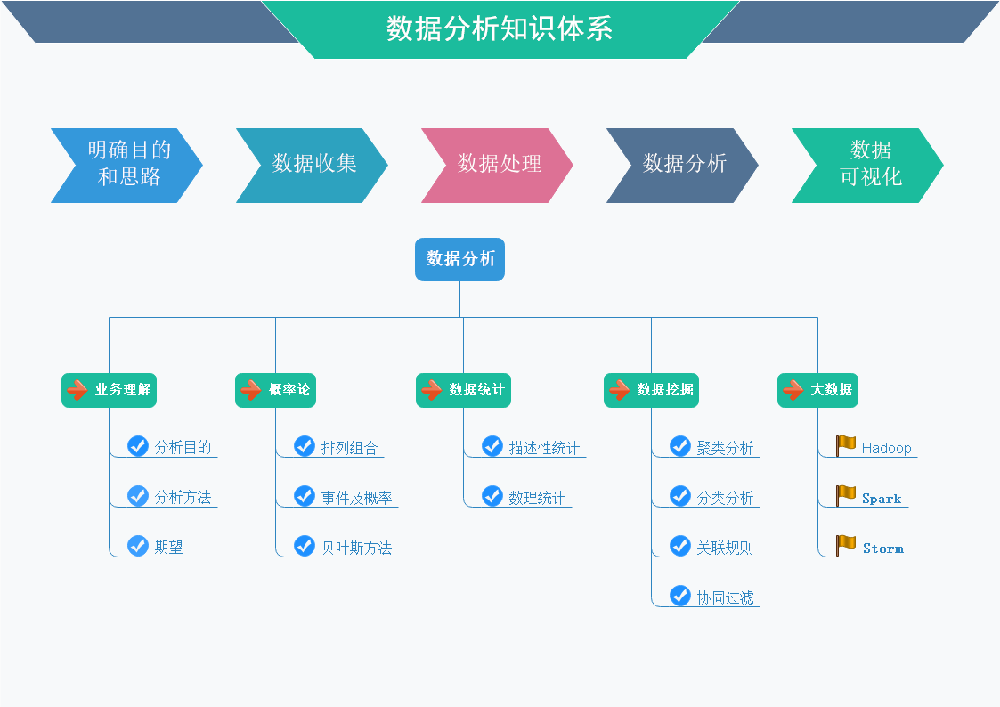

### 软性条件
?> 具有业务知识，运用逻辑思维很重要！

#### 懂业务
> &emsp;&emsp;从事数据分析工作的前提就会需要懂业务，即熟悉行业知识、公司业务及流程，最好有自己独到的见解，若脱离行业认知和公司业务背景，分析就没有太大的使用价值

#### 懂管理
> &emsp;&emsp;一方面是搭建数据分析框架的要求，比如确定分析思路就需要用到营销、管理等理论知识来指导，如果不熟悉管理理论，就很难搭建数据分析的框架，后续的数据分析也很难进行；另一方面的作用是针对数据分析结论提出有指导意义的分析建议

#### 懂分析
> &emsp;&emsp;指掌握数据分析基本原理与一些有效的数据分析方法，并能灵活运用到实践工作中，以便有效的开展数据分析。基本的分析方法有：对比分析法、分组分析法、交叉分析法、结构分析法、漏斗图分析法、综合评价分析法、因素分析法、矩阵关联分析法等。高级的分析方法有：相关分析法、回归分析法、聚类分析法、判别分析法、主成分分析法、因子分析法、对应分析法、时间序列等

#### 懂工具
> &emsp;&emsp;指掌握数据分析相关的常用工具。数据分析方法是理论，而数据分析工具就是实现数据分析方法理论的工具，面对越来越庞大的数据，我们不能依靠计算器进行分析，必须依靠强大的数据分析工具帮我们完成数据分析工作  

#### 懂设计
> &emsp;&emsp;是指运用图表有效表达数据分析师的分析观点，使分析结果一目了然。图表的设计是门大学问，如图形的选择、版式的设计、颜色的搭配等等，都需要掌握一定的设计原则