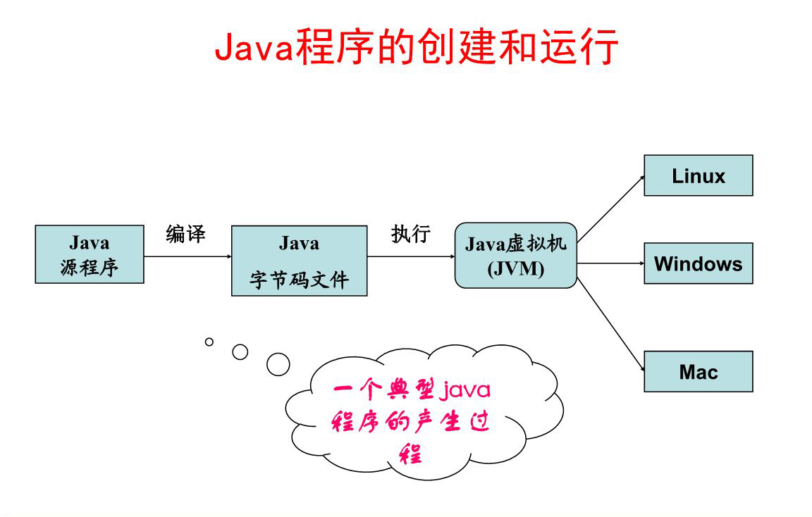
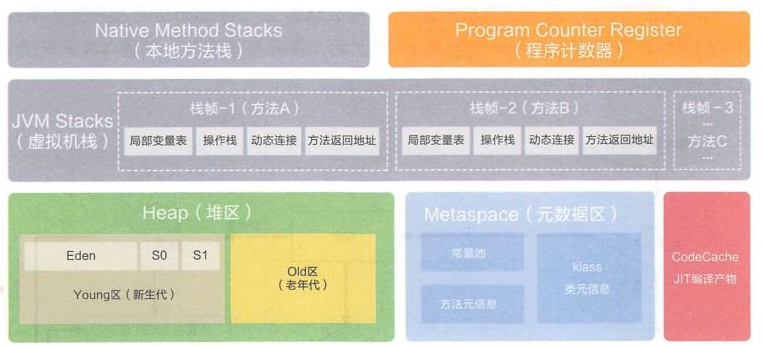

## JVM
&emsp;&emsp;JVM(Java Virtual Machine)即Java虚拟机，是JRE的一部分，主要是用于识别和执行Java源代码。JVM有自己完善的硬件架构，如处理器、堆栈、寄存器等，还具有相应的指令系统。
JVM在运行时将Java字节码以JIT的编译方式将它们转换成原生代码，Java字节码是Java虚拟机的基础，也是部署Java程序的最小单元。
##### 与JRE、JDK区别：
- JRE(JavaRuntimeEnvironmen)  
&emsp;&emsp;Java运行环境，也就是Java平台。所有的Java 程序都要在JRE下才能运行。普通用户只需要运行已开发好的java程序，安装JRE即可。

- JDK(Java Development Kit)  
&emsp;&emsp;是程序开发者用来来编译、调试java程序用的开发工具包。JDK的工具也是Java程序，也需要JRE才能运行。为了保持JDK的独立性和完整性，在JDK的安装过程中，JRE也是 安装的一部分。
所以，在JDK的安装目录下有一个名为jre的目录，用于存放JRE文件。


#### 1、字节码
&emsp;&emsp;Java语言最重要的特点就是跨平台运行，它的使命就是一次编写，到处执行，使用JVM就是为了支持与操作系统无关，实现跨平台。

&emsp;&emsp;“字节码”作为一种中间层存在，在代码执行过程中，JVM将字节码解释执行，屏蔽对底层操作系统的依赖；JVM也可以将字节码编译执行，如果是热点代码，会通过JIT动态地编译为机器码，提高执行效率。
#### 2、类加载机制
&emsp;&emsp; 计算机模型中，任何程序都需要加载到内存才能与CPU进行交流。字节码.class文件同样需要加载到内存中，才可以实例化类。类加载是一个将.class字节码文件实例化成Class对象并进行相关初始化的过程。
在这个过程中，JVM会初始化还没有被初始化过的所有父类，并且会执行这个链路上所有未执行过的静态代码块、静态变量赋值语句等。
Java的类加载器是一个运行时核心基础设施模块，主要是在启动之初进行类的Load、Link和Init，即加载、链接、初始化。  
&emsp;&emsp;（1）Load阶段读取类文件产生二进制流，并转化为特定的数据结构，初步校验cafe babe魔法数、常量池、文件长度、是否有父类等，然后创建对应类的java.lang.Class实例；  
&emsp;&emsp;（2）Link阶段包括验证、准备、解析三个步骤。验证是更详细的校验，比如final是否合规、类型是否正确、静态变量是否合理等；准备阶段是为静态变量分配内存，并设定默认值，解析类和方法确保类与类之间的相互引用正确性，完成内存结构布局。  
&emsp;&emsp;（3）Init阶段执行类构造器<clinit>方法，如果赋值运算是通过其它类的静态方法来完成的，那么会马上解析另外一个类，在虚拟机栈中执行完毕后通过返回值进行赋值。  

```java
package com.demo;

import java.lang.reflect.Field;

/**
 * @author: 暗香彻骨.沐之杰（Hugo）
 * @Contact: qyx01@qq.com
 * @Software: IntelliJ IDEA
 * @Time: 2019/5/4 14:58
 * @File: ClassLoadPorcedure.java
 * @Description: 类加载示例代码练习
 **/
public class ClassLoadPorcedure {
    // 数组类型有一个魔法属性：length来获取数组长度
    private static int [] array = new int[3];
    private static int length = array.length;

    // 任何小写class定义的类，也有一个魔法属性：class，来获取此类的大写Class类对象
    private static Class<One> one = One.class;
    private static Class<Another> another = Another.class;

    public static void main(String[] args) throws Exception{
        // 通过newInstance方法创建One和Another的类对象 （第1处）
        One oneObject = one.newInstance();
        oneObject.call();

        Another anotherObject = another.newInstance();
        anotherObject.speak();

        // 通过 one这个大写的Class对象，获取私有成员属性对象Field  (第2处）
        Field privateFieldInone = one.getDeclaredField("inner");

        // 设置私有对象可以访问和修改 （第3处）
        privateFieldInone.setAccessible(true);

        privateFieldInone.set(oneObject, "The world is changing.");
        // 成功修改类的私有属性inner变量值为world changed.
        System.out.println(oneObject.getInner());
    }
}

class One {
    private String inner = "time flies.";

    public void call(){
        System.out.println("Hello World");
    }

    public String getInner(){
        return inner;
    }
}

class Another{
    public void speak(){
        System.out.println("Easy coding.");
    }
}
```
#### 3、内存布局
&emsp;&emsp;JVM内存布局规定了Java在运行过程中内存申请、分配、管理的策略，保证了JVM的高效稳定运行。


#### 4、对象实例化
&emsp;&emsp;Java是面向对象的静态强类型语言，根据某个类声明一个引用变量指定被创建的对象，并使用此引用变量操作对象。

###### Java实例化对象5种方法：
- （1）用new语句直接创建对象，这是最常见的创建对象的方法。
- （2）通过工厂方法返回对象，如:String str = String.valueOf(23); 

- （3）运用反射手段,调用java.lang.Class或者java.lang.reflect.Constructor类的newInstance()实例方法。如:Object obj = Class.forName("java.lang.Object").newInstance(); 

- （4）调用对象的clone()方法。

- （5）通过I/O流(包括反序列化)，如运用反序列化手段，调用java.io.ObjectInputStream对象的 readObject()方法。
```java
Person person = new Person()
/*
  1，JVM会去读取指定路径下的Person.class文件，并加载进内存，并会先加载Person的父类（如果有直接父类的情况下）; 
  2，在堆内存中开辟空间，分配地址; 
  3，并在对象空间中，对对象中的属性进行默认初始化; 
  4，调用对应的构造函数，进行初始化; 
  5，在构造函数中，第一行会先调用父类中的构造函数进行初始化; 
  6，父类初始化完毕后，再对子类的属性，进行显示初始化; 
  7，指定构造函数的特定初始化; 
  8，初始化完毕后，将堆内存中的地址值赋给引用变量。
*/
```
[comment]: <(1)new：如果找不到Class对象，则进行类加载。加载成功后，则在堆中分配内存，从Object开始到本类路径上的所有属性值都要分配内存。> 

## 异常与日志 

## 并发与多线程