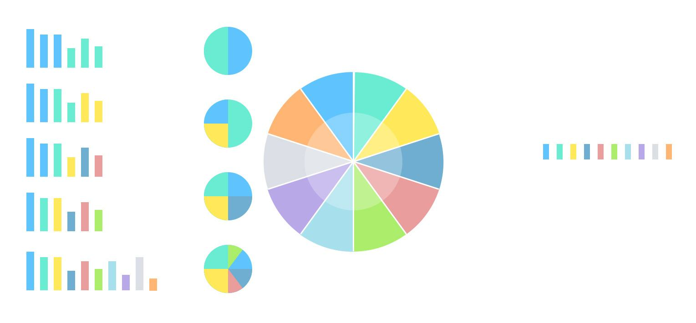

## Excel
&emsp;&emsp;Excel主要是用来存储数据和处理数据的工作，Excel从功能上分为数据源表和数据报表。由于数据报表是由目的导向的，不同的目的要求就会有不同的处理方法和呈现形式。此处仅探讨作为数据源表时的Excel操作规范。  

`不要觉得简单，任何简单的事情乘以数量级都会变得不容易，而且会遇到超出预期的困难。`

- 常见数据类型
    - 文本型
    - 整数型
    - 小数型
    - 布尔型
    - 日期型
    
#### 禁止
- 1、禁用合并单元格（除非打印或报表需要），因为：会被很多“大佬”吐槽。  
- 2、对于存储“编码”、“日期”、“数值”的列，禁止使用“常规”的单元格数据类型。
- 3、用作最终数据存档、数据流转的Excel表格，禁止含有公式的单元格。因为：下一个处理者无法知道哪些单元格会存有公式，如果观察不到就会很容易在下一步数据数量中出现错误。  
- 4、对于存储“数值”的列，禁用“无”或“-”代替空单元格。因为：如，在将Excle数据导入数据库时，数值类型的字段含有非数字类型时会导致错误。  
- 5、禁止使用如“20190208”、“2019.2.8”的日期类型，正确的日期格式：yyyy-MM-dd(入库数据推荐此种格式)、yyyy/MM/dd，同理，时间格式为：yyyy-MM-dd HH : mm : ss （24小时制）。  
- 6、禁止使用空格对齐两个字的姓名，如果需要对齐，请设置单元格格式为分散对齐。
- 7、禁止任性随意行为，如：任意更改列名的顺序，频繁更改列名名称等。因为后期用Python等工具做历史数据清理的话，会很容易出现错误，且不易被察觉。

#### 建议
- 1、对于存储“编码”、“身份证号码”以及超过11位的数值列， 推荐使用文本格式，或输入英文单引号“'”。因为：Excel会将以“0”开头的数字吃掉。  
- 2、删除多余的表头、空行、空列、合计行，因为这些在使用SQL或Python等其它工具处理时没有任何作用，只会增加负担甚至造成更大的错误。  
- 3、一个单元格只记录一个属性，避免出现“200瓶”等，应当分为两列分别存为两列“200”、“瓶”。
- 4、使用单层表头。
- 5、合理设计字段，如宁可分别设计“省”、“市/州”、“区/县”三列，也不要单独设计一列“省市区”。
- 6、数据处理以简单原则优先，避免过长的公式。

##### Excel中常见单元格数据格式类型应用场景 ：

单元格数据格式 | 说明 
---|---
常规 | Excel默认数据格式，会自动根据输入内容自动判断。如：输入“2/8”会默认为当年日期“2019/2/8”;输入编号“007”就只显示“7”了；不要使用此格式来保存编码、身份证号码和金额等。 |
数值 | 用于表示数量，可设置小数位数及千分位显示。 |
货币 | 财务常用，支持多种货币符号显示。 | |	
会计专用 | ￥2019.00 ||	
日期 | yyyy/MM/dd是Excel默认的日期类型，输入日期时，年、月、日之间要用“/”号或“-”号隔开。日期格式应当统一风格，不要任意输入。 |
时间 | 手动输入时间要注意使用英文“:”，不要使用中文“：”。 |	
科学计数 |   如果不设置格式，输入身份证号码后会默认以科学计数的格式显示。 |	
文本 | 强烈要求对编码、单号、身份证号码使用文本类型，文本格式也日期格式不能混用。 |
特殊 | 适用于中国式报表，比如金额大写。 |	
自定义 | 自定义格式慎用，不要给其他人造成麻烦。 |

---

## 数据可视化

#### 数据展示
数据的展示分成比较、序列、构成、描述四种。

#### 原则
- 加法：信息完整性、易读性。
- 减法：排除视觉干扰。
- 布局：要注意对齐、对比、重复；
- 配色：基于红黄蓝三原色设计的色轮。将颜搭配分成下面四类：单色、类比色、补色、分裂补色。

#### 避免
- 1、无度量单位；
- 2、数据位数太长；
- 3、无排序、重点不突出；
- 4、.相对差异不明显；
