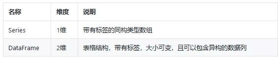

## 核心数据结构
##### pandas最核心的就是Series和DataFrame两个数据结构。
        
DataFrame可以看做是Series的容器，即：一个DataFrame中可以包含若干个Series。

## Pandas 中的入门函数
### 读取数据
```python
data=pd.read_csv('my_file.csv')
data=pd.read_csv(my_file.csv',sep=';",encoding="latin-1',nrows=1000,skiprous=[2,5])
```
sep参数的意思就是分隔符。如果你要处理的是法语数据，Excel中使用的csv分隔符是“;”，那么你需要通过这个参数显式地声明分隔符。encoding参数需要设置为“latin-1”以便能识别出法语的字符；n_rows=1000表示读取前1000行数据；skiprows=[2,5]的意思是在读取文件时去掉第2行和第5行的数据。

最常用的函数是：read_csv和read_excel
其他几个非常好用的函数是：read_clipboard和read_sql

### 写入数据
```python
data.to_csv("my_new_file.csv",index=None)
```
通过设置index=None，就会原原本本地将数据写入到文件中。如果你没有指定index=None，程序就会在文件中新增一个索引列，这个列在所有列的最前面，值为0,1,2,3…直到最后一行。

我一般不用像.to_excel，.to_json，.to_pickle这些函数，因为.to_csv这个函数已经非常好用了！而且，csv也是目前最常用的存储表格数据的文件格式。

### 检查数据
```python
data.shape
```
验证(rows, columns)信息是否与数据的行、列数相符3
```python
data.describe()
```
计算一些基本的统计量，如数据计数、均值、标准差、分位数等。

### 查看数据
```python
data.head(3)
```
打印数据的前3行。和.head()函数类似，也可以通过.tail()函数查看数据最后几行。

```Python
data.loc[8]
```
打印行索引为8的行。（注意下标默认从0开始）

``` 
data.loc[8,'column_1']
```
打印行索引为8，列名为’column_1’所指向的数据。

```Python
data.loc[range(4,6)]
```
输出行索引从4到6的行数据（不包括6）

## Pandas 中的基本函数
### 逻辑操作符
通过逻辑操作符或取数据的子集。可以使用 & (AND)，~ (NOT) 以及 | (OR) 这些常用的操作符，在逻辑操作的前后记得加上括号。

```Python
data[data['coluan_1'].isin(["french','engllsh'])]
```
如果有时候需要对同一列使用大量的OR操作，通常使用.isin()函数代替。

### 基本绘图函数
能实现这个功能主要还是得益于matplotlib库。像我们在介绍中说的，这个库的大部分功能都可以直接通过pandas使用。
```Python
data['column_numerical'].plot()
```
函数的输出示例.jpg 'Plotting')

```Python
data['column_numerical'].hist()
```  
这个函数绘制的是分布图（也称直方图）。     
函数输出示例.jpg 'Plotting')

如果你使用的是Jupyter，不要忘了在绘图前加上这一行`%matplotlib inline`（只需要在notebook中声明一次即可）。

### 更新数据
```Python
data.loc[8,'column_1']='english'
``` 
用“english”替换行索引为8列名为‘column_1’时所指向的值。
```Python
data.loc[data['column_1']=='french','column_1']='French'
``` 
用1行代码更改多行数据的值。

## 中级函数
### 统计频数
的输出示例.jpg 'Plotting')

### 针对行、列或者所有数据的操作
```Python
data['column_1'].map(1en)
```
len()函数会应用到’column_1’列下的每一个元素。
.map()操作会将一个函数应用到指定列的每一个元素。
```Python
data['column_1']. map(1en). map(1ambda x:x/100).plot()
```
Pandas库中一个非常好用的功能就是链式方法。它能够帮助你通过一行代码完成多个操作（比如这里的.map()函数和.plot()函数），既简单又高效。   
apply函数会将一个函数应用到所有列。
applymap ()函数会将一个函数应用到表格的所有单元。

### tqdm——独一无二的模块
当处理大规模数据集时，pandas需要花费一些时间来完成.map()，.apply()，.applymap()操作。tqdm是一个非常有用的库，能够预测这些操作什么时候执行结束。（好吧，我说谎了，我之前说过我们只用pandas库）。可以使用 ” pip install tqdm” 命令安装tqdm。
```Python
# 使用pandas来创建tqdm进程
from tqdm import tqdm_notebook
tqdm_notebook().pandas()
```
用.progress_map()替换.map()函数，对.apply()函数和.applymap()函数也是一样的。
```Python
data['column_1'].progress_map(lambda x:x.count('e"))
```


### 相关矩阵和散布矩阵（scatter matrices）
```Python 
data.corr()
data. corr(). applymap(lambda x: int(x*100)/100)
```

```Python
pd.plotting.scatter_matrix(data,figsize=(12,8))
```


## Pandas的高级操作
### SQL的连接功能
```Python
data.merge(other_data,on=['column_1','column_2','column_3'])
```
只需要一行代码就可以将3列连接到一起。

### 分组功能
刚开始使用这个功能的时候并不容易，你首先需要掌握一些语法知识，之后你会发现自己再也离不开这个功能了。
```Python
data.groupby('column_1)['column_2'].apply(sum).reset_index()
```
基于某一列对数据进行分组，再对另一列上的数据执行一些函数操作。.reset_index()函数可以将数据转变为DataFrame（表格）的形式。        


### 遍历行
```Python
dictionary={}
for i, row in data. iterrows():
dictionary[row['column_1']]=row['column_2]
```
.iterrows()函数同时获取2个变量并实现循环：分别是行的索引和行的对象（也就是上面代码中的i和row）。
