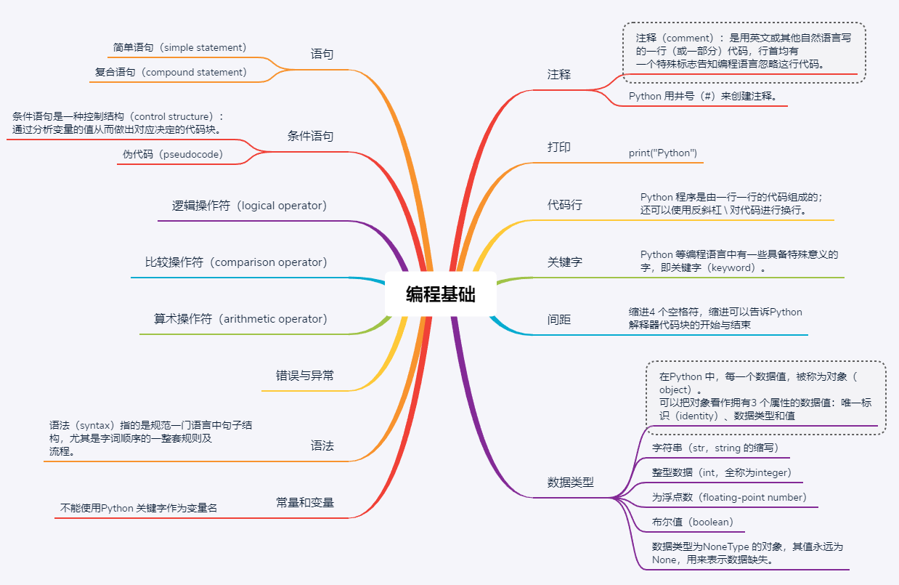
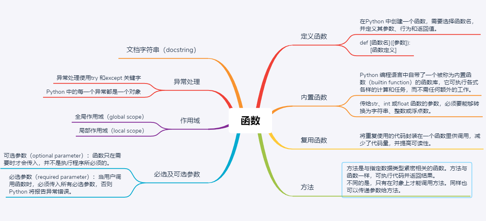
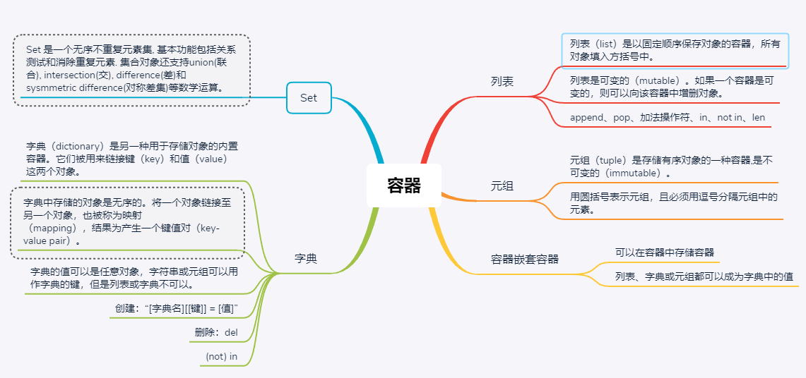
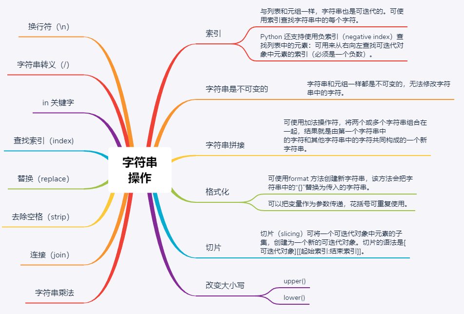
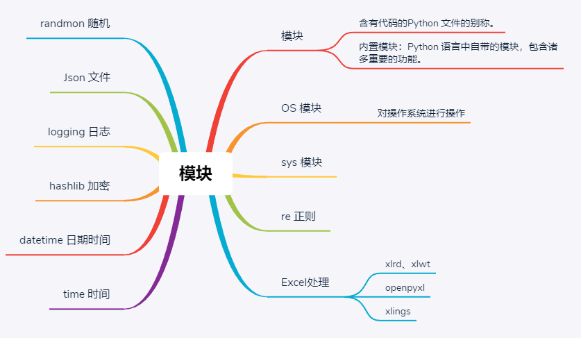
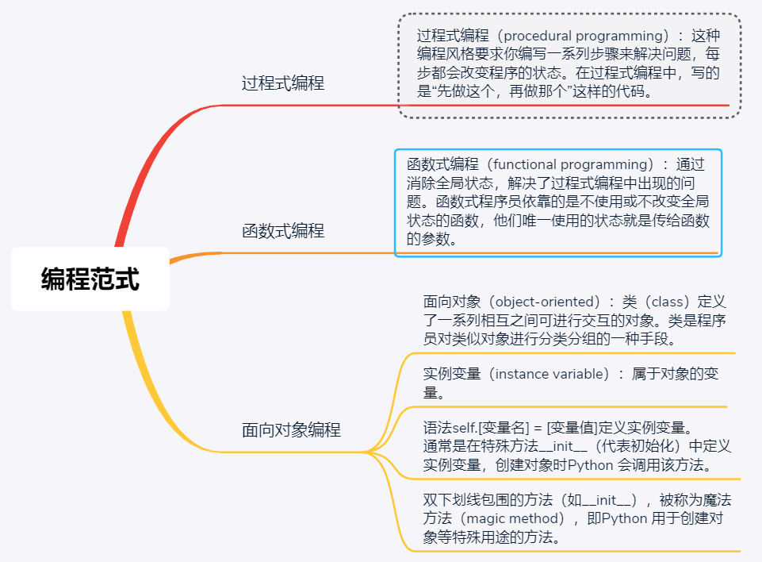
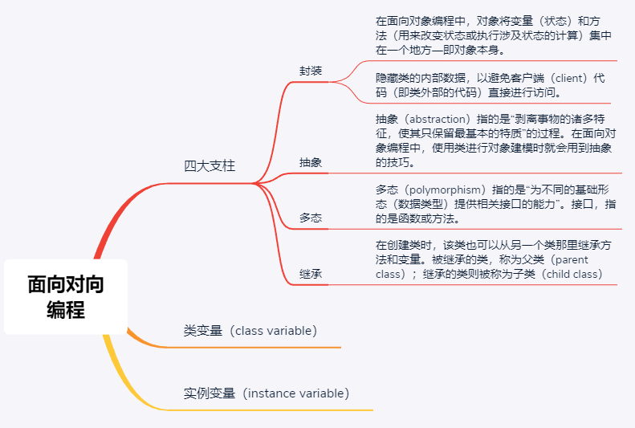

## 编程基础


* 与Java不同，Python是弱类型语言，弱类型语言有两个典型特征：
 >   1、变量无须声明即可直接赋值；   
    2、变量的数据类型可以动态改变。
## 函数


## 容器
> 字符串、列表和元组都是可迭代的（iterable）。如果可以使用循环访问对象中的每一
  个元素，那么该对象是可迭代的，被称为可迭代对象。可迭代对象中的每一个元素都有
  一个索引（index），即表示元素在可迭代对象中位置的数字。列表中第一个元素的索引
  是0，而不是1。
  

 
## 字符串


## 模块


## 编程范式


## 面向对象编程


`为了更好的理解面向对象编程，请继续（类似Java）`

> 常见步骤：
  1. 导入各种外部库
  2. 设计各种全局变量
  3. 决定你要的类
  4. 给每个类提供完整的一组操作
  5. 明确地使用继承来表现不同类之间的共同点
  6. 根据需要，决定是否写一个main函数作为程序入口  
  
&emsp;&emsp;面向对象编程中，将函数和变量进一步封装成类，类才是程序的基本元素，它将数据和操作紧密地连结在一起，并保护数据不会被外界的函数意外地改变。类和和类的实例（也称对象）是面向对象的核心概念，是和面向过程编程、函数式编程的根本区别。  
&emsp;&emsp;并不是非要用面向对象编程，要看你的程序怎么设计方便，但是就目前来说，基本上都是在使用面向对象编程。

#### 类的基本用法
&emsp;&emsp;面向对象是通过定义class类来定义，这么说面向对象编程就是只使用class类，在class类中有封装，继承的功能，并且还可以构造要传入的参数，方便控制。  、
```python
import sys
import time
reload(sys)
sys.setdefaultencoding('utf-8')

class studetn:
    # 定义一个类名为studetn
    def __init__(self,idx):
    # 定义初始化构造，这里使用init，还有别的属性比如reversed，iter之类的
        self.idx=idx
        # 初始化变量，方便继承
    def runx(self):
    # 定义运行函数，从上面继承变量
        print self.idx
        # 打印出idx的值，或者做一些别的处理
        time.sleep(1)
a=studetn('a')
a.runx()
# 这是类的调用，一定要记得类的使用方法，首先传入参数，类赋值给一个变量a
# 然后调用这个类下面定义的函数
```

> &emsp;1、类(Class): 用来描述具有相同属性和方法的对象的集合。它定义了该集合中每个对象所共有的属性和方法。其中的对象被称作类的实例。   
  &emsp;2、实例：也称对象。通过类定义的初始化方法，赋予具体的值，成为一个”有血有肉的实体”。   
  &emsp;3、实例化：创建类的实例的过程或操作。   
  &emsp;4、实例变量：定义在实例中的变量，只作用于当前实例。    
  &emsp;5、类变量：类变量是所有实例公有的变量。类变量定义在类中，但在方法体之外。 
  &emsp;6、数据成员：类变量、实例变量、方法、类方法、静态方法和属性等的统称。   
  &emsp;7、方法：类中定义的函数。 
  &emsp;8、静态方法：不需要实例化就可以由类执行的方法。   
  &emsp;9、类方法：类方法是将类本身作为对象进行操作的方法。    
  &emsp;10、方法重写：如果从父类继承的方法不能满足子类的需求，可以对父类的方法进行改写，这个过程也称override。  
  &emsp;11、封装：将内部实现包裹起来，对外透明，提供api接口进行调用的机制。   
  &emsp;12、继承：即一个派生类（derived class）继承父类（base class）的变量和方法。    
  &emsp;13、多态：根据对象类型的不同以不同的方式进行处理。    

#### 类与实例
```python
# -*- conding: utf-8 -*-
# @Author:暗香彻骨.沐之杰 (Hugo)
# @Contact : qyx01@qq.com 
# @Time: 2019/2/1 9:34
# @Software： PyCharm
# @File: 类与实例.py
# @Description:

import sys
import time
import requests
reload(sys)
sys.setdefaultencoding('utf-8')


class cc:
    ccc = 'ccc'
    # cc就是类名 如果想要继承别的类 就class cc(threading) 意思就是从threading继承
    def __init__(self,a,b,c):
        self.a=a
        self.b=b
        self.c=c
        # 定义构造的过程就是实例化
    def runx(self):
        print self.a*10
        print self.b*5
        print self.c*2
    def runy(self):
        print requests.get('http://www.langzi.fun').headers
e = cc('AAA','CCC','EEE')
e.runx()
e.runy()
# 这两个就是调用类里面的方法
print e.c
#实例变量指的是实例本身拥有的变量。每个实例的变量在内存中都不一样。
print e.ccc
#类变量，在类里面找到定义的变量。
```

#### 调用类的三种方法
##### 1、实例方法
```python
import sys
import time
import requests
reload(sys)
sys.setdefaultencoding('utf-8')

class dd:
    def __init__(self,url):
        self.url=url
    def runx(self):
        print requests.get(self.url).status_code

a = dd('http://www.langzi.fun')
a.runx()
# 这种调用方法就是实例方法
```

##### 2、静态方法
&emsp;&emsp;静态方法由类调用，无默认参数。将实例方法参数中的self去掉，然后在方法定义上方加上@staticmethod，就成为静态方法。它属于类，和实例无关。建议只使用类名.静态方法的调用方式。

```python
import sys
import requests
reload(sys)
sys.setdefaultencoding('utf-8')
class ff:
    @staticmethod
    def runx():
        print requests.get('http://www.langzi.fun').status_code
ff.runx()
#这里就直接调用了类的变量，只在类中运行而不在实例中运行的方法
```

##### 2、类方法
&emsp;&emsp;类方法由类调用，采用@classmethod装饰，至少传入一个cls（代指类本身，类似self）参数。执行类方法时，自动将调用该方法的类赋值给cls。建议只使用类名.类方法的调用方式。
```python
import sys
import requests
reload(sys)
sys.setdefaultencoding('utf-8')
class gg:
    url = 0
    stat = 0
    # 因为使用classmethod后会传入新的变量，所以一开始是需要自己先定义类变量
    def __init__(self,url=0,stat=0):
    # 这里按照正常的定义构造函数
        self.url=url
        self.stat=stat
    @classmethod
    # 装饰器，立马执行下面的函数
    def split(cls,info):
        # 这个函数接受两个参数，默认的cls就是这个类的init函数，info就是外面传入进来的
        url,stat=map(str,info.split('-'))
        # 这里转换成了格式化的结构
        data = cls(url,stat)
        # 然后执行这个类第一个方法，这个类构造函数需要传入两个参数，于是就传入了两个参数
        return data
        # 这里就直接返回了函数结果
    def outer(self):
        print self.url
        print self.stat

r = gg.split(('langzi-200'))
r.outer()
# 这里是调用类方法，与调用实例方法一样
```

### 类的特性
#### 封装
&emsp;&emsp;封装是指将数据与具体操作的实现代码放在某个对象内部，外部无法访问。必须要先调用类的方法才能启动。
```python
class cc:
    ccc = 'ccc'
    # cc就是类名 如果想要继承别的类 就class cc(threading) 意思就是从threading继承
    def __init__(self,a,b,c):
        self.a=a
        self.b=b
        self.c=c
print e.ccc
#类变量，在类里面找到定义的变量。
print ccc
# 这里会报错，这就是封装。类中的函数同理。
```
#### 继承
&emsp;&emsp;当我们定义一个class的时候，可以从某个现有的class继承，新的class称为子类（Subclass），而被继承的class称为基类、父类或超类（Base class、Super class）。
比如，我们已经编写了一个名为Animal的class，有一个run()方法可以直接打印：
```python
class Animal(object):
    def run(self):
        print 'Animal is running...'
```
&emsp;&emsp;当我们需要编写Dog和Cat类时，就可以直接从Animal类继承：
```python
class Dog(Animal):
    pass
class Cat(Animal):
    pass
```

&emsp;&emsp;继承有什么好处？最大的好处是子类获得了父类的全部功能。由于Animial实现了run()方法，因此，Dog和Cat作为它的子类，什么事也没干，就自动拥有了run()方法：
```python
dog = Dog()
dog.run()
cat = Cat()
cat.run()
```
> 当子类和父类都存在相同的run()方法时，我们说，子类的run()覆盖了父类的run()，在代码运行的时候，总是会调用子类的run()。这样，我们就获得了继承的另一个好处：多态。

#### 多态
&emsp;&emsp;要理解多态的好处，我们还需要再编写一个函数，这个函数接受一个Animal类型的变量：
```python
def run_twice(animal):
    animal.run()
    animal.run()
```
当我们传入Animal的实例时，run_twice()就打印出：
```python
run_twice(Animal())
运行结果：
Animal is running...
Animal is running...
```
当我们传入Dog的实例时，run_twice()就打印出：
```python
run_twice(Dog())
运行结果：
Dog is running...
Dog is running...
```
当我们传入Cat的实例时，run_twice()就打印出：
```python
run_twice(Cat())
运行结果：
Cat is running...
Cat is running...
```
现在，如果我们再定义一个Tortoise类型，也从Animal派生：
```python
class Tortoise(Animal):
    def run(self):
        print 'Tortoise is running slowly...'
```
当我们调用run_twice()时，传入Tortoise的实例：
```python
run_twice(Tortoise())
运行结果：
Tortoise is running slowly...
Tortoise is running slowly...
```
&emsp;&emsp;你会发现，新增一个Animal的子类，不必对run_twice()做任何修改，实际上，任何依赖Animal作为参数的函数或者方法都可以不加修改地正常运行，原因就在于多态。   
&emsp;&emsp;`多态的好处`就是，当我们需要传入Dog、Cat、Tortoise……时，我们只需要接收Animal类型就可以了，因为Dog、Cat、Tortoise……都是Animal类型，然后，按照Animal类型进行操作即可。由于Animal类型有run()方法，因此，传入的任意类型，只要是Animal类或者子类，就会自动调用实际类型的run()方法，这就是多态的意思：    
&emsp;&emsp;对于一个变量，我们只需要知道它是Animal类型，无需确切地知道它的子类型，就可以放心地调用run()方法，而具体调用的run()方法是作用在Animal、Dog、Cat还是Tortoise对象上，由运行时该对象的确切类型决定，这就是多态真正的威力：调用方只管调用，不管细节，而当我们新增一种Animal的子类时，只要确保run()方法编写正确，不用管原来的代码是如何调用的。这就是著名的“开闭”原则：      

&emsp;&emsp;对扩展开放：允许新增Animal子类；   
&emsp;&emsp;对修改封闭：不需要修改依赖Animal类型的run_twice()等函数。     

&emsp;&emsp;总结：继承可以把父类的所有功能都直接拿过来，这样就不必重零做起，子类只需要新增自己特有的方法，也可以把父类不适合的方法覆盖重写；有了继承，才能有多态。在调用类实例方法的时候，尽量把变量视作父类类型，这样，所有子类类型都可以正常被接收；   
旧的方式定义Python类允许不从object类继承，但这种编程方式已经严重不推荐使用。任何时候，如果没有合适的类可以继承，就继承自object类。  

## 魔法方法
&emsp;&emsp;在Python中，所有以“ __ ” 双下划线包起来的方法，都统称为 “Magic Method”，中文称『魔术方法』,例如类的初始化方法 __init__ ,Python中所有的魔术方法均在官方文档中有相应描述， 使用Python的魔法方法可以使Python的自由度变得更高，当不需要重写时魔法方法也可以在规定的默认情况下生效，在需要重写时也可以让使用者根据自己的需求来重写部分方法来达到自己的期待。  

| 函数 | 	说明 | 
| :---         |     :---:      |
| __ init__  | 构造函数，在生成对象时调用 |
| __ del__ | 析构函数，释放对象时使用 |
| __ repr__ | 打印，转换 |
| __ setitem__ | 按照索引赋值 |    
| __ getitem__ | 按照索引获取值 |
| __ len__ | 获得长度 |
| __ cmp__ |  比较运算 |
| __ call__ |  调用 |
| __ add__ |  加运算 |
| __ sub__ | 减运算 |
| __ mul__ | 乘运算 |
| __ div__ | 除运算 |
| __ mod__ | 求余运算 |
| __ pow__ | 幂 | 

#### __ init__()

```python 
class Foo:
    def __init__(self, name):
        self.name = name
        self.age = 18
obj = Foo('jack') # 自动执行类中的 __init__ 方法
```
#### __ module__ 和 __ class__
module 表示当前操作的对象在属于哪个模块。   
class 表示当前操作的对象属于哪个类。  
这两者也是Python内建，无需自定义。  
```python
class Foo:
    pass
obj = Foo()
print(obj.__module__)
print(obj.__class__) # ==>main

```